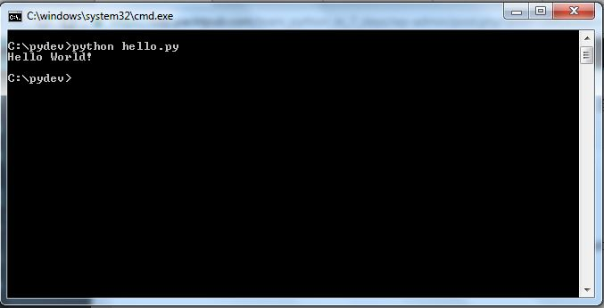

# Sensai vibe coding workshop

> ## “Everyone is a programmer. Now, you just have to say something to the computer.” - Jensen Huang

Podczas tego tygodnia dowiesz się:

*   jak programować korzystając z edytorów kodu jak Cursor, Windsurf i platform typu [Bolt.new](http://bolt.new/), czy Lovable
*   jak wybrać model do kodowania
*   jak pisać dobre prompty
*   jak korzystać z serwerów MCP do programowania
*   jak używać GitHuba
*   jak tworzyć ui, np. jako interfejs do automatyzacji w n8n czy do skryptów python
*   jak wystawić nasz kod do internetu, bezpiecznie wszystko skonfigurować tak żeby nie narazić się na utratę danych czy niespodziewane rachunki
*   jak tworzyć dodatki do przeglądarki

**Czemu uczyć się programować?**

*   Niezależność w tworzeniu rozwiązań
*   Bo fajnie jest tworzyć coś swojego
*   Automatyzacja i oszczędność czasu
*   Konkurencyjność na rynku pracy
*   Zrozumienie technologii i programistów
*   Możliwość budowania własnych rozwiązań pod właasne potrzeby
*   wykorzystanie z pracy innych i dostosowanie jej pod własne wymagania

Bariery techniczne znikają, co sprawia, że co raz więcej osób zaczyna programować, i że zaczyna liczyć się jeszcze bardziej pomysł. Jak wiadomo od pomysłu do wykonania często długa droga, ale nawet jeśli nie chcemy samemu wdrażać naszych pomysłów to świadomość możliwości jak i ograniczeń technicznych powinna sprawić że nasze pomysły będą jeszcze lepsze, a co za tym idzie zyskujemy przewagę na tym konkurencyjnym rynku jakim jest SEO. Świat zmienia się aktualnie tak szybko że codziennie pojawiają się nowe problemy do rozwiązania. Przedstawię Ci narzędzia i koncepty do realizacji Twoich pomysłów skutecznie i bezpiecznie.

# Podstawy

### **🤨 Czym jest programowanie?**

**Programowanie to sposób tworzenia instrukcji, które mówią komputerowi, jak rozwiązać konkretny problem — najczęściej prowadząc użytkownika z punktu A do punktu B. Można je porównać do przepisu kulinarnego albo instrukcji dojazdu: zawierają krok po kroku, co ma się wydarzyć.**



#### N8N

W trakcie tego kursu zetknęłaś się już z formą programowania – automatyzacjami w **n8n**. Tam, zamiast pisać kod, używamy gotowych modułów, które łączymy graficznie. To podejście jest bardzo wygodne, szczególnie gdy zależy nam na **szybkim wdrożeniu i prostocie**.

#### Python

Teraz pójdziemy o krok dalej i zajmiemy się **programowaniem w Pythonie**. To język tekstowy, który daje nam **nieograniczone możliwości**, ale wymaga nieco więcej nauki. Python jest idealny do zadań, które są zbyt złożone dla n8n, na przykład do zaawansowanej analizy danych, uczenia maszynowego czy budowania niestandardowych narzędzi.


#### Wizualizacja procesu

Myślenie o programowaniu jako o procesie pomaga zrozumieć jego logikę. Każdy krok w procesie to fragment kodu, który wykonuje określone zadanie.


#### Przykładowy skrypt w Pythonie

To jest przykład kompletnego skryptu w Pythonie, który pobiera wszystkie linki z mapy strony (sitemap) i zapisuje je do pliku CSV. Nie musisz go teraz w pełni rozumieć — chodzi o to, żeby zobaczyć, jak wygląda kod, który realizuje konkretne zadanie.

```python
import requests
import xml.etree.ElementTree as ET
import csv
from urllib.parse import urljoin, urlparse
import time
from typing import List, Set

class SitemapExtractor:
    def __init__(self, timeout: int = 10):
        """
        Inicjalizuje ekstraktor sitemap
        
        Args:
            timeout: Timeout dla HTTP requestów w sekundach
        """
        self.timeout = timeout
        self.session = requests.Session()
        self.session.headers.update({
            'User-Agent': 'Mozilla/5.0 (Windows NT 10.0; Win64; x64) AppleWebKit/537.36'
        })
    
    def fetch_sitemap(self, url: str) -> str:
        """
        Pobiera zawartość sitemap z podanego URL
        
        Args:
            url: URL do sitemap
            
        Returns:
            Zawartość XML jako string
        """
        try:
            response = self.session.get(url, timeout=self.timeout)
            response.raise_for_status()
            return response.text
        except requests.RequestException as e:
            print(f"Błąd podczas pobierania {url}: {e}")
            return ""
    
    def parse_sitemap_index(self, xml_content: str) -> List[str]:
        """
        Parsuje sitemap index i zwraca listę URL-ów do sub-sitemaps
        
        Args:
            xml_content: Zawartość XML sitemap index
            
        Returns:
            Lista URL-ów do sub-sitemaps
        """
        try:
            root = ET.fromstring(xml_content)
            
            # Sprawdzamy różne namespace'y
            namespaces = {
                'ns': 'http://www.sitemaps.org/schemas/sitemap/0.9'
            }
            
            sitemap_urls = []
            
            # Szukamy elementów sitemap w sitemap index
            for sitemap in root.findall('.//ns:sitemap', namespaces):
                loc = sitemap.find('ns:loc', namespaces)
                if loc is not None and loc.text:
                    sitemap_urls.append(loc.text.strip())
            
            # Fallback - szukamy bez namespace
            if not sitemap_urls:
                for sitemap in root.findall('.//sitemap'):
                    loc = sitemap.find('loc')
                    if loc is not None and loc.text:
                        sitemap_urls.append(loc.text.strip())
            
            return sitemap_urls
            
        except ET.ParseError as e:
            print(f"Błąd parsowania XML sitemap index: {e}")
            return []
    
    def parse_sitemap_urls(self, xml_content: str) -> List[dict]:
        """
        Parsuje sitemap i zwraca listę URL-ów z metadanymi
        
        Args:
            xml_content: Zawartość XML sitemap
            
        Returns:
            Lista słowników z URL-ami i metadanymi
        """
        try:
            root = ET.fromstring(xml_content)
            
            # Sprawdzamy różne namespace'y
            namespaces = {
                'ns': 'http://www.sitemaps.org/schemas/sitemap/0.9'
            }
            
            urls = []
            
            # Szukamy elementów url w sitemap
            for url in root.findall('.//ns:url', namespaces):
                url_data = {}
                
                # Lokalizacja (wymagana)
                loc = url.find('ns:loc', namespaces)
                if loc is not None and loc.text:
                    url_data['loc'] = loc.text.strip()
                
                # Ostatnia modyfikacja (opcjonalna)
                lastmod = url.find('ns:lastmod', namespaces)
                if lastmod is not None and lastmod.text:
                    url_data['lastmod'] = lastmod.text.strip()
                
                # Częstotliwość zmian (opcjonalna)
                changefreq = url.find('ns:changefreq', namespaces)
                if changefreq is not None and changefreq.text:
                    url_data['changefreq'] = changefreq.text.strip()
                
                # Priorytet (opcjonalny)
                priority = url.find('ns:priority', namespaces)
                if priority is not None and priority.text:
                    url_data['priority'] = priority.text.strip()
                
                if 'loc' in url_data:
                    urls.append(url_data)
            
            # Fallback - szukamy bez namespace
            if not urls:
                for url in root.findall('.//url'):
                    url_data = {}
                    
                    loc = url.find('loc')
                    if loc is not None and loc.text:
                        url_data['loc'] = loc.text.strip()
                    
                    lastmod = url.find('lastmod')
                    if lastmod is not None and lastmod.text:
                        url_data['lastmod'] = lastmod.text.strip()
                    
                    changefreq = url.find('changefreq')
                    if changefreq is not None and changefreq.text:
                        url_data['changefreq'] = changefreq.text.strip()
                    
                    priority = url.find('priority')
                    if priority is not None and priority.text:
                        url_data['priority'] = priority.text.strip()
                    
                    if 'loc' in url_data:
                        urls.append(url_data)
            
            return urls
            
        except ET.ParseError as e:
            print(f"Błąd parsowania XML sitemap: {e}")
            return []
```
```python
def is_sitemap_index(self, xml_content: str) -> bool:
        """
        Sprawdza czy XML to sitemap index czy zwykły sitemap
        
        Args:
            xml_content: Zawartość XML
            
        Returns:
            True jeśli to sitemap index, False jeśli zwykły sitemap
        """
        try:
            root = ET.fromstring(xml_content)
            
            # Sprawdzamy czy istnieją elementy sitemapindex
            namespaces = {
                'ns': 'http://www.sitemaps.org/schemas/sitemap/0.9'
            }
            
            # Sprawdzamy z namespace
            if root.find('.//ns:sitemapindex', namespaces) is not None:
                return True
            if root.find('.//ns:sitemap', namespaces) is not None:
                return True
            
            # Sprawdzamy bez namespace
            if root.find('.//sitemapindex') is not None:
                return True
            if root.tag == 'sitemapindex' or 'sitemapindex' in root.tag:
                return True
            
            return False
            
        except ET.ParseError:
            return False
    
    def extract_urls_from_domain(self, domain: str) -> List[dict]:
        """
        Wyciąga wszystkie URL-e z sitemap danej domeny
        
        Args:
            domain: Domena (np. 'https://example.com' lub 'https://example.com/')
            
        Returns:
            Lista słowników z URL-ami i metadanymi
        """
        # Normalizujemy domenę
        if not domain.startswith(('http://', 'https://')):
            domain = 'https://' + domain
        
        if not domain.endswith('/'):
            domain += '/'
        
        # Konstruujemy URL do sitemap
        sitemap_url = urljoin(domain, 'sitemap.xml')
        
        print(f"Pobieranie sitemap z: {sitemap_url}")
        
        # Pobieramy główny sitemap
        xml_content = self.fetch_sitemap(sitemap_url)
        if not xml_content:
            return []
        
        all_urls = []
        
        # Sprawdzamy czy to sitemap index
        if self.is_sitemap_index(xml_content):
            print("Wykryto sitemap index, pobieranie sub-sitemaps...")
            
            # Pobieramy URL-e do sub-sitemaps
            sub_sitemap_urls = self.parse_sitemap_index(xml_content)
            print(f"Znaleziono {len(sub_sitemap_urls)} sub-sitemaps")
            
            # Pobieramy każdy sub-sitemap
            for i, sub_url in enumerate(sub_sitemap_urls, 1):
                print(f"Pobieranie sub-sitemap {i}/{len(sub_sitemap_urls)}: {sub_url}")
                
                sub_xml_content = self.fetch_sitemap(sub_url)
                if sub_xml_content:
                    urls = self.parse_sitemap_urls(sub_xml_content)
                    all_urls.extend(urls)
                    print(f"  Znaleziono {len(urls)} URL-ów")
                
                # Mała przerwa między requestami
                time.sleep(0.1)
        
        else:
            print("Wykryto zwykły sitemap, parsowanie URL-ów...")
            # To zwykły sitemap, parsujemy URL-e bezpośrednio
            all_urls = self.parse_sitemap_urls(xml_content)
        
        print(f"Łącznie znaleziono {len(all_urls)} URL-ów")
        return all_urls
    
    def extract_urls_from_sitemap_url(self, sitemap_url: str) -> List[dict]:
        """
        Wyciąga URL-e z konkretnego URL sitemap
        
        Args:
            sitemap_url: Bezpośredni URL do sitemap
            
        Returns:
            Lista słowników z URL-ami i metadanymi
        """
        print(f"Pobieranie sitemap z: {sitemap_url}")
        
        xml_content = self.fetch_sitemap(sitemap_url)
        if not xml_content:
            return []
        
        all_urls = []
        
        if self.is_sitemap_index(xml_content):
            print("Wykryto sitemap index, pobieranie sub-sitemaps...")
            
            sub_sitemap_urls = self.parse_sitemap_index(xml_content)
            print(f"Znaleziono {len(sub_sitemap_urls)} sub-sitemaps")
            
            for i, sub_url in enumerate(sub_sitemap_urls, 1):
                print(f"Pobieranie sub-sitemap {i}/{len(sub_sitemap_urls)}: {sub_url}")
                
                sub_xml_content = self.fetch_sitemap(sub_url)
                if sub_xml_content:
                    urls = self.parse_sitemap_urls(sub_xml_content)
                    all_urls.extend(urls)
                    print(f"  Znaleziono {len(urls)} URL-ów")
                
                time.sleep(0.1)
        else:
            print("Wykryto zwykły sitemap, parsowanie URL-ów...")
            all_urls = self.parse_sitemap_urls(xml_content)
        
        print(f"Łącznie znaleziono {len(all_urls)} URL-ów")
        return all_urls
    
    def save_to_csv(self, urls: List[dict], filename: str = 'sitemap_urls.csv'):
        """
        Zapisuje URL-e do pliku CSV
        
        Args:
            urls: Lista słowników z URL-ami
            filename: Nazwa pliku wyjściowego
        """
        if not urls:
            print("Brak URL-ów do zapisania")
            return
        
        # Zbieramy wszystkie możliwe klucze
        fieldnames = set()
        for url in urls:
            fieldnames.update(url.keys())
        
        fieldnames = sorted(list(fieldnames))
        
        with open(filename, 'w', newline='', encoding='utf-8') as csvfile:
            writer = csv.DictWriter(csvfile, fieldnames=fieldnames)
            writer.writeheader()
            writer.writerows(urls)
        
        print(f"Zapisano {len(urls)} URL-ów do pliku: {filename}")
    
    def save_to_txt(self, urls: List[dict], filename: str = 'sitemap_urls.txt'):
        """
        Zapisuje tylko URL-e do pliku tekstowego (jeden URL na linię)
        
        Args:
            urls: Lista słowników z URL-ami
            filename: Nazwa pliku wyjściowego
        """
        if not urls:
            print("Brak URL-ów do zapisania")
            return
        
        with open(filename, 'w', encoding='utf-8') as f:
            for url_data in urls:
                if 'loc' in url_data:
                    f.write(url_data['loc'] + '
')
        
        print(f"Zapisano {len(urls)} URL-ów do pliku: {filename}")


def main():
    """
    Funkcja główna - przykład użycia
    """
    # Inicjalizujemy ekstraktor
    extractor = SitemapExtractor(timeout=10)
    
    # Opcja 1: Podaj domenę (automatycznie dodaje /sitemap.xml)
    domain = "https://phu.io.vn/"
    urls = extractor.extract_urls_from_domain(domain)
    
    # Opcja 2: Podaj bezpośredni URL do sitemap
    # sitemap_url = "https://example.com/sitemap.xml"
    # urls = extractor.extract_urls_from_sitemap_url(sitemap_url)
    
    if urls:
        # Zapisujemy wyniki
        extractor.save_to_csv(urls, 'sitemap_urls.csv')
        extractor.save_to_txt(urls, 'sitemap_urls.txt')
        
        # Wyświetlamy przykładowe URL-e
        print(f"
Przykładowe URL-e (pierwsze 5):")
        for i, url in enumerate(urls[:5]):
            print(f"{i+1}. {url.get('loc', 'N/A')}")
        
        # Statystyki
        print(f"
Statystyki:")
        print(f"Łącznie URL-ów: {len(urls)}")
        
        # Sprawdzamy domeny
        domains = set()
        for url in urls:
            if 'loc' in url:
                parsed = urlparse(url['loc'])
                domains.add(parsed.netloc)
        
        print(f"Unikalne domeny: {len(domains)}")
        for domain in sorted(domains):
            print(f"  - {domain}")
    
    else:
        print("Nie znaleziono żadnych URL-ów")


if __name__ == "__main__":
    main()
```

### 📝 Języki programowania


Rozmawiając z modelami językowymi możemy pisać aplikacje nie tworząc samemu ani linijki kodu. Dlatego bardziej niż składnia języka powinny nas interesować jego inne cechy, do czego służy, jakie ma mocne strony i jakie są jego ograniczenia. To po prostu wybór odpowiedniego narzędzia do zadania.

W praktyce wystarczy nam Python do przetwarzania danych i jako język serwera, Javascript jako język obsługujący interakcje usera ze stroną napisaną w HTML/CSS.

[https://benjdd.com/languages/](https://benjdd.com/languages/)

#### 🐘 SQL

o tym mówił już Damian, w module o Supabase.

[ info o SQL]

Alternatywą jest NoSQL stosowany np. w Firebase

#### 🐍 Python

Jest to najpopularniejszy język programowania. Na GitHub jeśli chodzi o projekty Open Source, wyprzedził w 2024 roku Javascript.

Nazwany na cześć grupy Monty Python ponad 30 lat temu.

Jest to język wysokopoziomowy (czyli łatwy dla człowieka, nie dla komputera), napisany w C.


Wszechstronny, mnogość zastosowań w AI

Mocne strony:

*   prosta składnia
*   Mnogość bibliotek do przetwarzania i analizy danych (pandas, BeautifulSoup) i sdk (google, supabase), Crawl4AI
*   Mało "ceremonii" w kodzie
*   Alternatywa to Node.js ALE:

##### **Pełny przykład Node.js - to samo zadanie co Python:**

```javascript
// Najpierw instalacja pakietów:
// npm install csv-parser exceljs

const fs = require('fs');
const csv = require('csv-parser');
const ExcelJS = require('exceljs');

// Funkcja główna (bo Node.js wymaga async/await dla Excel)
async function analizujKeywords() {
  const results = [];

  // 1. Wczytanie CSV
  await new Promise((resolve, reject) => {
    fs.createReadStream('keywords.csv')
      .pipe(csv())
      .on('data', (data) => {
        // Konwersja pozycji na liczbę (csv-parser zwraca stringi)
        data.pozycja = parseInt(data.pozycja);
        results.push(data);
      })
      .on('end', resolve)
      .on('error', reject);
  });

  // 2. Filtrowanie top 10
  const top10 = results.filter(row => row.pozycja <= 10);

  // 3. Zapis do Excel
  const workbook = new ExcelJS.Workbook();
  const worksheet = workbook.addWorksheet('Top 10');

  // Dodanie nagłówków (zakładamy że CSV ma kolumny: keyword, pozycja, klikniecia)
  worksheet.columns = [
    { header: 'Keyword', key: 'keyword', width: 30 },
    { header: 'Pozycja', key: 'pozycja', width: 10 },
    { header: 'Kliknięcia', key: 'klikniecia', width: 15 }
  ];

  // Dodanie danych
  top10.forEach(row => {
    worksheet.addRow(row);
  });

  // Zapisanie pliku
  await workbook.xlsx.writeFile('raport.xlsx');

  console.log('Gotowe! Zapisano do raport.xlsx');
}

// Uruchomienie z obsługą błędów
analizujKeywords().catch(error => {
  console.error('Błąd:', error);
});
```

###### **Porównanie kodu:**

**Python (3 linie):**

```python
dane = pd.read_csv("keywords.csv")
top10 = dane[dane['pozycja'] <= 10]
top10.to_excel("raport.xlsx")
```

**Node.js (40+ linii):**

*   Instalacja 2 pakietów
*   Import 3 modułów
*   Async/await wrapper
*   Promise dla strumienia
*   Ręczna konwersja typów
*   Ręczne definiowanie kolumn
*   Obsługa błędów
*   Callback hell (częściowo)

###### **Dodatkowe komplikacje w Node.js:**

1.  **Typy danych:**

```javascript
data.pozycja = parseInt(data.pozycja);
// Python - pandas robi to automatycznie
```

1.  **Struktura danych:**

```javascript
// Node.js - musisz ręcznie definiować kolumny Excel
worksheet.columns = [
  { header: 'Keyword', key: 'keyword', width: 30 },
  // ...
];
// Python - pandas zachowuje strukturę automatycznie
```

1.  **Obsługa asynchroniczności:**

```javascript
// Node.js - wszystko musi być w async/await lub callbackach
async function analizujKeywords() {
  await new Promise((resolve, reject) => {
    // ...
  });
}
// Python - synchroniczny, prosty przepływ
```

###### **Realny czas developmentu:**

| Zadanie | Python | Node.js |
| --- | --- | --- |
| Napisanie kodu | 30 sekund | 5-10 minut |
| Debugowanie | Rzadko potrzebne | Często (typy, async) |
| Instalacja bibliotek | pip install pandas openpyxl | npm install csv-parser exceljs |
| Dokumentacja | Prosta, spójna | Różna dla każdej biblioteki |

To pokazuje dlaczego Python dominuje w analizie danych - robi więcej przy mniejszym nakładzie kodu i czasu.

#### 📒 Javascript/ Typescript

Kluczowe dla aplikacji webowych. Pisze się w nim zarówno obsługę kliknięć w przyciski,

#### 🏠 Html + CSS

Choć formalnie nie są to języki.

HTML HTML + CSS


### 📚 **Podstawowe koncepty w kodzie**

Ucząc się jednego języka programowania dużo łatwiej nauczyć nam się kolejnych. Podobnie jak poznamy język włoski łatwiej nam nauczyć się hiszpańskiego. Jest tak dlatego, że języki te operują na podobnych konceptach, mają zbliżoną składnię. Tu użyjemy Pythona, ale te same koncepty stosowane są w innych językach.

#### **1. Zmienne - Pojemniki na dane**

Zmienna to jak komórka w Excelu - miejsce gdzie przechowujesz informację.

```python
# Zmienne tekstowe (string)
keyword = "buty nike"
url = "https://example.com/buty"

# Zmienne liczbowe
pozycja = 11
liczba_wyswietlen = 15420
ctr = 2.5  # procent

# Zmienne logiczne (True/False)
czy_w_top10 = False
czy_zindeksowana = True

# Używanie zmiennych
print(f"Keyword '{keyword}' jest na pozycji {pozycja}")
# Wynik: Keyword 'buty nike' jest na pozycji 11
```

**Analogia SEO**: Zmienna to jak parametr w Google Analytics - przechowuje konkretną wartość którą możesz później wykorzystać.

#### **2. Funkcje - Gotowe przepisy**

Funkcja to zestaw instrukcji które możesz używać wielokrotnie. Jak makro w Excelu!

```python
# Definicja funkcji
def sprawdz_pozycje(keyword, pozycja):
    """Sprawdza czy keyword jest w TOP10"""
    if pozycja <= 10:
        return f"✅ '{keyword}' jest w TOP10 (poz. {pozycja})"
    else:
        return f"❌ '{keyword}' poza TOP10 (poz. {pozycja})"

# Użycie funkcji
wynik1 = sprawdz_pozycje("buty nike", 5)
wynik2 = sprawdz_pozycje("adidas sneakers", 15)

print(wynik1)  # ✅ 'buty nike' jest w TOP10 (poz. 5)
print(wynik2)  # ❌ 'adidas sneakers' poza TOP10 (poz. 15)
```

**Praktyczny przykład SEO**:

```python
def oblicz_potencjal_ruchu(impressions, pozycja_obecna, pozycja_docelowa=3):
    """Oblicza potencjalny wzrost ruchu po awansie"""
    ctr_obecny = get_ctr_dla_pozycji(pozycja_obecna)
    ctr_docelowy = get_ctr_dla_pozycji(pozycja_docelowa)

    ruch_obecny = impressions * ctr_obecny / 100
    ruch_potencjalny = impressions * ctr_docelowy / 100

    wzrost = ruch_potencjalny - ruch_obecny
    return round(wzrost)

# Użycie
potencjal = oblicz_potencjal_ruchu(10000, 11, 3)
print(f"Możesz zyskać {potencjal} dodatkowych kliknięć miesięcznie!")
```

#### **3. Listy - Kolekcje danych**

Lista to jak kolumna w Excelu - przechowuje wiele wartości.

```python
# Lista keywords
keywords = ["buty nike", "adidas sneakers", "puma buty", "reebok classic"]

# Dodawanie do listy
keywords.append("new balance")

# Dostęp do elementów (numeracja od 0!)
pierwszy_keyword = keywords[0]  # "buty nike"
ostatni_keyword = keywords[-1]  # "new balance"

# Przetwarzanie całej listy
for keyword in keywords:
    print(f"Analizuję: {keyword}")
```

**Słowniki - dane z etykietami**:

```python
# Słownik to jak wiersz w Excelu z nazwanymi kolumnami
dane_keyword = {
    "keyword": "buty nike",
    "pozycja": 11,
    "impressions": 15420,
    "clicks": 234,
    "url": "https://example.com/buty-nike"
}

# Dostęp do danych
print(dane_keyword["keyword"])  # "buty nike"
print(dane_keyword["pozycja"])  # 11

# Lista słowników (jak tabela w Excelu)
wyniki_seo = [
    {"keyword": "buty nike", "pozycja": 11, "impressions": 15420},
    {"keyword": "adidas sneakers", "pozycja": 5, "impressions": 8900},
    {"keyword": "puma buty", "pozycja": 23, "impressions": 3200}
]
```

#### **4. Warunki - Podejmowanie decyzji**

Instrukcje warunkowe pozwalają programowi reagować różnie w zależności od sytuacji.

```python
pozycja = 11

# Prosty warunek
if pozycja <= 10:
    print("Świetnie! Jesteś w TOP10")
else:
    print("Trzeba popracować nad pozycją")

# Złożone warunki
if pozycja <= 3:
    status = "🥇 TOP3 - Excellent!"
elif pozycja <= 10:
    status = "✅ TOP10 - Dobra robota"
elif pozycja <= 20:
    status = "📈 TOP20 - Jest potencjał"
else:
    status = "💪 Wymaga pracy"

# Operatory logiczne
if pozycja > 10 and impressions > 1000:
    print("Duży potencjał - warto zoptymalizować!")

if ctr < 1 or pozycja > 50:
    print("Pilna interwencja potrzebna!")
```

#### **5. Pętle - Automatyzacja powtórzeń**

Pętle pozwalają wykonać te same operacje dla wielu elementów.

```python
# Pętla for - gdy znasz ilość powtórzeń
keywords = ["buty nike", "adidas sneakers", "puma buty"]

for keyword in keywords:
    print(f"Sprawdzam pozycję dla: {keyword}")
    # Tu normalnie byłoby wywołanie API

# Pętla while - gdy nie wiesz ile razy
strona = 1
while strona <= 10:
    print(f"Pobieram wyniki ze strony {strona}")
    strona = strona + 1
    # Przerwij jeśli nie ma więcej wyników
    if brak_wynikow:
        break
```

**Praktyczny przykład - analiza wielu URL**:

```python
urls_do_sprawdzenia = [
    "https://example.com/kategoria-1",
    "https://example.com/kategoria-2",
    "https://example.com/produkt-1"
]

for url in urls_do_sprawdzenia:
    status_code = sprawdz_status(url)  # funkcja sprawdzająca
    if status_code == 404:
        print(f"❌ BŁĄD 404: {url}")
    elif status_code == 200:
        print(f"✅ OK: {url}")
```

#### **6. Klasy - Szablony obiektów**

Klasa to jak formularz - definiuje strukturę danych i co można z nimi zrobić.

```python
class AnalizaKeyword:
    def __init__(self, keyword, url):
        self.keyword = keyword
        self.url = url
        self.pozycja = None
        self.impressions = 0
        self.clicks = 0

    def oblicz_ctr(self):
        if self.impressions > 0:
            return (self.clicks / self.impressions) * 100
        return 0

    def czy_wymaga_optymalizacji(self):
        return self.pozycja > 10 and self.impressions > 1000

# Użycie klasy
analiza1 = AnalizaKeyword("buty nike", "/buty-nike")
analiza1.pozycja = 15
analiza1.impressions = 5000
analiza1.clicks = 50

print(f"CTR: {analiza1.oblicz_ctr():.2f}%")
if analiza1.czy_wymaga_optymalizacji():
    print("🎯 Ten keyword ma duży potencjał!")
```

#### **7. Import bibliotek - Korzystanie z gotowych narzędzi**

Biblioteki to gotowe zestawy funkcji które możesz używać.

```python
# Import całej biblioteki
import pandas as pd
import requests

# Import konkretnej funkcji
from datetime import datetime
from collections import Counter

# Przykład użycia
# Pandas - jak Excel w Pythonie
df = pd.read_csv('keywords.csv')
top10 = df[df['pozycja'] <= 10]

# Requests - pobieranie danych z internetu
response = requests.get('https://api.example.com/data')

# Counter - liczenie wystąpień
keywords = ["nike", "adidas", "nike", "puma", "nike"]
licznik = Counter(keywords)
print(licznik)  # {'nike': 3, 'adidas': 1, 'puma': 1}
```

#### **8. Obsługa błędów - Gdy coś pójdzie nie tak**

```python
try:
    # Próbuj wykonać kod
    response = requests.get(api_url)
    data = response.json()
except requests.exceptions.Timeout:
    print("❌ API nie odpowiada - timeout")
except Exception as e:
    print(f"❌ Wystąpił błąd: {e}")
else:
    # Wykonaj jeśli nie było błędu
    print("✅ Dane pobrane pomyślnie")
finally:
    # Wykonaj zawsze (np. zamknij połączenie)
    print("Zakończono operację")
```

### 🛠️ Narzędzia

No code

[https://x.com/Mrcontech/status/1933538141052211478](https://x.com/Mrcontech/status/1933538141052211478)


[https://bolt.new/](https://bolt.new/)

[https://lovable.dev/](https://lovable.dev/)

[https://v0.dev/](https://v0.dev/)

[https://replit.com/](https://replit.com/)

[https://www.tempo.new/](https://www.tempo.new/)

[https://x.com/Mrcontech/status/1933538141052211478/photo/1](https://x.com/Mrcontech/status/1933538141052211478/photo/1)

Code

Cursor

Windsurf

SuperCode

Claude Code

### 🛡️ Bezpieczeństwo

## <mark><strong>Security is not a feature, it's a requirement.</strong></mark>


```markdown
⚠️ ZŁOTA ZASADA: Klucze API to jak hasła!
- NIGDY nie wrzucaj ich do GitHub
- Używaj pliku .env (pokażemy jak)
- Testuj najpierw na małych danych

Przykład co może pójść źle:
- Wrzucisz klucz API na GitHub = ktoś go ukradnie
- Zapętlisz skrypt = 10000 requestów do API = rachunek 💸
```

#### 🔍 PIP AUDIT - Skaner bezpieczeństwa bibliotek Pythona

`pip audit` to narzędzie do skanowania zależności Pythona pod kątem znanych podatności bezpieczeństwa. Jak antywirus, ale dla twoich bibliotek!

##### Instalacja:

```shell
bash
pip install pip-audit
```

##### Użycie:

```shell
bash
# Skanuj obecne środowisko
pip-audit

# Skanuj requirements.txt
pip-audit -r requirements.txt

# Automatyczna naprawa (jeśli możliwa)
pip-audit --fix

# Szczegółowy raport
pip-audit --desc
```

##### Przykładowy output:

```text
Found 2 known vulnerabilities in 2 packages
Name       Version  ID             Fix Versions
---------- -------- -------------- ------------
flask      1.0.2    PYSEC-2019-179 >=1.0.3
requests   2.6.0    PYSEC-2021-101 >=2.26.0
```

#### 🔍 NPM AUDIT - Skaner bezpieczeństwa bibliotek Node

`npm audit` to wbudowane narzędzie do skanowania zależności Node.js pod kątem znanych podatności bezpieczeństwa. Jak antywirus, ale dla twoich pakietów npm!

Instalacja:

```shell
# Wbudowane w npm (6.0+) - nie wymaga instalacji
npm --version
```

Użycie:

```shell
# Skanuj projekt
npm audit

# Automatyczna naprawa (jeśli możliwa)
npm audit fix

# Wymuszenie naprawy (może wprowadzić breaking changes)
npm audit fix --force

# Tylko podatności o wysokim/krytycznym poziomie
npm audit --audit-level high

# Format JSON dla dalszego przetwarzania
npm audit --json

# Szczegółowy raport
npm audit --parseable
```

**Kiedy używać npm audit:**

🔄 **Regularnie:**

*   Co tydzień/miesiąc w aktywnych projektach
*   Przed każdym deploymentem produkcyjnym
*   Po dodaniu nowych zależności

⚡ **Natychmiast:**

*   Gdy otrzymasz alert o nowej podatności
*   Przed rozpoczęciem pracy nad starszym projektem
*   Po klonowaniu repozytorium

🏗️ **W procesie CI/CD:**

*   Dodaj do pipeline'u jako gate przed deploymentem
*   Zautomatyzuj sprawdzanie w pull requestach

⚠️ **Pilnie:**

*   Gdy twoja aplikacja obsługuje wrażliwe dane
*   W aplikacjach bankowych/finansowych

**Przykładowy output:**

```text
# npm audit report

lodash  <=4.17.10
Severity: high
Prototype Pollution - https://npmjs.com/advisories/782
fix available via `npm audit fix`
node_modules/lodash

2 high severity vulnerabilities

To address all issues, run:
  npm audit fix
```

**Bonus:** Dla większych projektów można użyć `yarn audit` (Yarn) lub `pnpm audit` (pnpm) - działają podobnie!

#### ✅ Security Rules (wklej to do .cursora)

Skopiuj to do cursorrules i waliduj kod przed deployem

authentication:
- ZAWSZE weryfikuj tokeny przed użyciem - nigdy nie ufaj inputowi użytkownika
- NIGDY nie wysyłaj tokenów w URL/query params - używaj Authorization headers
- NIGDY nie loguj pełnych tokenów - maksymalnie pierwsze/ostatnie 4 znaki
- Używaj krótkich czasów wygaśnięcia tokenów (30 min dla access, 7 dni dla refresh)
- Implementuj token rotation i refresh token flow
- Hashuj hasła używając bcrypt/argon2 z odpowiednim salt

database_security:
- ZAWSZE używaj Row Level Security (RLS) w Supabase/PostgreSQL
- NIGDY nie używaj service/admin keys w kodzie klienckim
- ZAWSZE używaj parametryzowanych zapytań - nigdy string concatenation
- Szyfruj wrażliwe dane przed zapisem do bazy (PII, tokeny, klucze API)
- Regularnie rotuj klucze dostępowe do bazy danych
- Ogranicz uprawnienia użytkowników bazy do minimum (principle of least privilege)

input_validation:
- ZAWSZE waliduj i sanityzuj wszystkie inputy użytkownika
- Sprawdzaj typy danych, długość, format, dozwolone znaki
- Odrzucaj podejrzane wzorce (Path Traversal: ../, SQL: '; DROP TABLE)
- Używaj whitelist zamiast blacklist dla dozwolonych wartości
- Escapuj specjalne znaki przed wyświetleniem (XSS prevention)
- Waliduj zarówno po stronie klienta jak i serwera

```
# Przykłady
# Autoryzacja
- |
  // ✅ DOBRZE - z headerem
  fetch('/api/endpoint', {
    headers: { 'Authorization': `Bearer ${token}` }
  })

  // ❌ ŹLE - token w URL
  fetch(`/api/endpoint?token=${token}`)

# Walidacja
- |
  // ✅ DOBRZE - właściwa walidacja
  const emailRegex = /^[^\s@]+@[^\s@]+\.[^\s@]+$/;
  if (!emailRegex.test(email)) throw new Error('Invalid email');

  // ❌ ŹLE - brak walidacji
  const email = req.body.email; // używane bez sprawdzenia

# Logowanie
- |
  // ✅ DOBRZE - bez wrażliwych danych
  logger.info(`User ${userId} logged in`);

  // ❌ ŹLE - logowanie tokenów
  logger.info(`Token: ${accessToken}`);

# Błędy
- |
  // ✅ DOBRZE - generyczny błąd
  res.status(500).json({ error: 'Internal server error' });

  // ❌ ŹLE - szczegóły implementacji
  res.status(500).json({ error: err.stack });

# Zapytania DB
- |
  // ✅ DOBRZE - parametryzowane
  db.query('SELECT * FROM users WHERE id = $1', [userId]);

  // ❌ ŹLE - konkatenacja
  db.query(`SELECT * FROM users WHERE id = ${userId}`);
```

supabase_specific:
- ZAWSZE włączaj RLS na wszystkich tabelach
- Używaj auth.uid() w politykach RLS
- Preferuj anon key nad service key w aplikacji
- Implementuj polityki dla SELECT, INSERT, UPDATE, DELETE osobno
- Testuj polityki RLS przed deploymentem
- Używaj Supabase Edge Functions dla wrażliwych operacji

deployment_security:
- Skanuj dependencies pod kątem vulnerabilities (npm audit)
- Używaj najnowszych wersji bibliotek z patchami bezpieczeństwa
- Implementuj CSP (Content Security Policy) headers
- Używaj HSTS dla wymuszenia HTTPS
- Regularnie przeprowadzaj pentesty
- Monitoruj logi pod kątem anomalii

monitoring:
- Loguj wszystkie nieudane próby logowania
- Monitoruj nietypowe wzorce dostępu
- Alertuj przy podejrzanych aktywnościach
- Regularnie przeglądaj logi bezpieczeństwa
- Implementuj audit trail dla krytycznych operacji

compliance:
- Przestrzegaj GDPR/RODO dla danych osobowych
- Implementuj right to be forgotten
- Szyfruj dane PII (Personally Identifiable Information)
- Dokumentuj przepływ danych osobowych
- Regularnie audytuj zgodność z przepisami

# KRYTYCZNE - NAPRAW NATYCHMIAST:

critical_vulnerabilities:
- Service key używany zamiast anon key w Supabase
- Brak weryfikacji tokenów OAuth przed użyciem
- Brak RLS na tabelach z wrażliwymi danymi
- SQL injection przez konkatenację stringów
- Logowanie haseł, tokenów lub kluczy API
- Hardkodowane klucze API w kodzie klienckim

### 🗂️ Struktura projektu frontendowego

Projekt generowany przez platformy [bolt.new](http://bolt.new) czy lovable.dev jest oparty na Vite + TypeScript, ze zintegrowanym Tailwind CSS i PostCSS oraz ESLint do lintowania. Jego struktura:


*   **node_modules** – folder z wszystkimi paczkami (zainstalowanymi przez npm/yarn).
*   **src/** – kod źródłowy aplikacji.
*   **index.html** – główny HTML, w którym Vite “wstrzykuje” bundlowane skrypty.
*   **package.json** & **package-lock.json** – deklaracja zależności i skryptów.
*   **vite.config.ts** – konfiguracja bundlera Vite.
*   **tsconfig.json**, **tsconfig.app.json**, **tsconfig.node.json** – ustawienia kompilatora TypeScript dla różnych części projektu.
*   **tailwind.config.js** & **postcss.config.js** – konfiguracja frameworka CSS.
*   **.eslintrc.cjs** – konfiguracja lintera ESLint.

### 🤖 Modele


**Czy najinteligentniejszy model jest najlepszy?**

Wybierając model musimy przede wszystkim wziąć pod uwagę w jakim środowisku go używamy - jeśli potrzebujemy skryptu bez zależności od większej liczby elementów systemy to spokojnie możemy go napisać z modelem w czacie, ale jeśli chcemy wykorzystać model jako agenta (np. w Cursorze) to jego skuteczność korzystania z narzędzi jest moim zdaniem istotniejsza niż jego wyniki w testach programistycznych.


[https://artificialanalysis.ai](https://artificialanalysis.ai)

#### Testy programistyczne dla modeli

##### **HumanEval**

*   **Najstarszy i najczęściej używany** benchmark do oceny generowania kodu
*   Składa się z **164 prostych zadań programistycznych** w Pythonie
*   Zadania to głównie **pojedyncze funkcje** z jasno określonymi specyfikacjami
*   **Relatywnie łatwy** - dlatego najlepsze modele osiągają tu wyniki 95%+
*   Przykład: "Napisz funkcję, która zwraca n-ty element ciągu Fibonacciego"

##### **SciCode**

*   Koncentruje się na **programowaniu naukowym i badawczym**
*   Zadania wymagają **głębokiej wiedzy domenowej** z matematyki, fizyki, chemii itp.
*   Często wymaga użycia **specjalistycznych bibliotek** (NumPy, SciPy)
*   **Trudniejszy niż HumanEval** - testuje zdolność modelu do rozumienia i stosowania złożonych algorytmów
*   Przykład: "Zaimplementuj metodę Monte Carlo do oszacowania wartości liczby Pi"

##### **LiveCodeBench**

*   **Najbardziej realistyczny i wymagający** benchmark
*   Zadania pochodzą z **prawdziwych konkursów programistycznych** (LeetCode, Codeforces)
*   Ocena opiera się na **przechodzeniu ukrytych testów**, tak jak w prawdziwym konkursie
*   Testuje **zdolność do rozwiązywania problemów**, a nie tylko generowania kodu
*   **Najtrudniejszy** - nawet najlepsze modele mają tu problemy
*   Przykład: "Znajdź najkrótszą ścieżkę w grafie z uwzględnieniem wag krawędzi"

### 🖊️ Cursor

Najpopularniejszy edytor kodu wsparty AI

Cursor i Windsurf to ”**zintegrowane środowisko programistyczne”** (IDE - Integrated Development Environment). W praktyce - edytory kodu, mające podświetlanie składni, wbudowany terminal, integracje z systemami zarządzanie wersją i wiele innych miłych w pracy z kodem funkcji. Co więcej, a może przede wszystkim, mają integrację z AI. To daje nam inteligentne podpowiedzi i agenta który pisze kod. Oba oparte są o VS Code od Microsoftu, najpopularniejsze IDE na świecie. Podobnie Windsurf ma swoje modele SWE-1 ale brak Claude’a Sonnet 4 to duży minus aktualnie

#### Setup

##### Privacy mode

ON

##### YOLO mode - auto-run denylist


[https://forum.cursor.com/t/cursor-yolo-deleted-everything-in-my-computer/103131](https://forum.cursor.com/t/cursor-yolo-deleted-everything-in-my-computer/103131)

```python
git, rm, opcjonalnie npm, pip, gcloud
```

##### Tab

Włączone

##### Modele

[Sensai vibe coding workshop](Sensai%20vibe%20coding%20workshop%20213666c7eacc800498dfd547dd29c4db.html)

##### Rules

[Sensai vibe coding workshop](Sensai%20vibe%20coding%20workshop%20213666c7eacc800498dfd547dd29c4db.html)

#### Prompting


### **Supabase Cheat Sheet**

#### Setup & Installation

```shell
# JS/TS Client
npm install @supabase/supabase-js

# Auth UI (opcjonalne)
npm install @supabase/auth-ui-react @supabase/auth-ui-shared

# SSR helpers (dla framework SSR)
npm install @supabase/ssr

# CLI (global)
npm install -g @supabase/cli
```

#### Environment Variables

```text
# .env.local
NEXT_PUBLIC_SUPABASE_URL=https://your-project.supabase.co
NEXT_PUBLIC_SUPABASE_ANON_KEY=your-anon-key

# Dla Vite
VITE_SUPABASE_URL=https://your-project.supabase.co
VITE_SUPABASE_ANON_KEY=your-anon-key

# SvelteKit
PUBLIC_SUPABASE_URL=https://your-project.supabase.co
PUBLIC_SUPABASE_ANON_KEY=your-anon-key
```

#### Podstawowy Client Setup

```javascript
import { createClient } from '@supabase/supabase-js'

const supabase = createClient(
  'https://your-project.supabase.co',
  'your-anon-key'
)

export default supabase
```

## Authentication

### Podstawowe Auth Operations

```javascript
// Sign Up
const { data, error } = await supabase.auth.signUp({
  email: 'example@email.com',
  password: 'example-password',
})

// Sign In
const { data, error } = await supabase.auth.signInWithPassword({
  email: 'example@email.com',
  password: 'example-password',
})

// Sign Out
const { error } = await supabase.auth.signOut()

// Get Current User
const { data: { user } } = await supabase.auth.getUser()

// Get Session
const { data: { session } } = await supabase.auth.getSession()
```

### OAuth Providers

```javascript
// Sign in z Google
const { data, error } = await supabase.auth.signInWithOAuth({
  provider: 'google',
  options: {
    redirectTo: 'http://localhost:3000/auth/callback'
  }
})

// Sign in z GitHub
const { data, error } = await supabase.auth.signInWithOAuth({
  provider: 'github'
})
```

### Auth State Listening

```javascript
// Listen for auth changes
supabase.auth.onAuthStateChange((event, session) => {
  if (event === 'SIGNED_IN') {
    console.log('User signed in:', session.user)
  }
  if (event === 'SIGNED_OUT') {
    console.log('User signed out')
  }
})
```

## Database Operations

### Basic CRUD

```javascript
// INSERT
const { data, error } = await supabase
  .from('profiles')
  .insert([
    { username: 'john_doe', website: 'https://johndoe.com' }
  ])

// SELECT
const { data, error } = await supabase
  .from('profiles')
  .select('*')

// SELECT with filtering
const { data, error } = await supabase
  .from('profiles')
  .select('username, website')
  .eq('username', 'john_doe')
  .single()

// UPDATE
const { data, error } = await supabase
  .from('profiles')
  .update({ website: 'https://new-website.com' })
  .eq('id', userId)

// DELETE
const { data, error } = await supabase
  .from('profiles')
  .delete()
  .eq('id', userId)
```

### Advanced Queries

```javascript
// Filtering
const { data, error } = await supabase
  .from('posts')
  .select('*')
  .eq('status', 'published')
  .gte('created_at', '2024-01-01')
  .order('created_at', { ascending: false })
  .limit(10)

// Joins
const { data, error } = await supabase
  .from('posts')
  .select(`
    *,
    profiles (
      username,
      avatar_url
    )
  `)

// Full text search
const { data, error } = await supabase
  .from('posts')
  .select('*')
  .textSearch('title', 'supabase')
```

### RPC Calls

```javascript
// Call stored procedure
const { data, error } = await supabase
  .rpc('match_documents', {
    query_embedding: embedding,
    match_threshold: 0.78,
    match_count: 10
  })
```

## Row Level Security (RLS)

### Enabling RLS

```sql
-- Enable RLS na tabeli
ALTER TABLE profiles ENABLE ROW LEVEL SECURITY;
```

### Basic RLS Policies

```sql
-- Policy dla SELECT - wszyscy mogą czytać profile
CREATE POLICY "Public profiles are viewable by everyone"
ON profiles FOR SELECT
USING (true);

-- Policy dla INSERT - użytkownicy mogą wstawiać tylko swoje profile
CREATE POLICY "Users can insert their own profile"
ON profiles FOR INSERT
WITH CHECK ((SELECT auth.uid()) = id);

-- Policy dla UPDATE - użytkownicy mogą aktualizować tylko swoje profile
CREATE POLICY "Users can update own profile"
ON profiles FOR UPDATE
USING ((SELECT auth.uid()) = id);

-- Policy dla DELETE - użytkownicy mogą usuwać tylko swoje profile
CREATE POLICY "Users can delete own profile"
ON profiles FOR DELETE
USING ((SELECT auth.uid()) = id);
```

### Advanced RLS Policies

```sql
-- Policy z JWT claims
CREATE POLICY "User is in team"
ON my_table
TO authenticated
USING (team_id IN (SELECT auth.jwt() -> 'app_metadata' -> 'teams'));

-- Policy z joinami (unikaj - wolne)
CREATE POLICY "rls_test_select" ON test_table
TO authenticated
USING (
  team_id IN (
    SELECT team_id
    FROM team_user
    WHERE user_id = (SELECT auth.uid())
  )
);

-- Optimized policy z security definer functions
CREATE OR REPLACE FUNCTION private.get_user_org_role(org_id bigint, user_id uuid)
RETURNS text
SET search_path = ''
AS $$
  SELECT role FROM public.org_members
  WHERE org_id = $1 AND user_id = $2;
$$ LANGUAGE sql SECURITY DEFINER;

CREATE POLICY "Org management restricted to owners"
ON public.organizations FOR ALL USING (
  private.get_user_org_role(id, (SELECT auth.uid())) = 'owner'
);
```

## Realtime

### Basic Subscriptions

```javascript
// Subscribe to table changes
const subscription = supabase
  .channel('profiles')
  .on('postgres_changes',
    {
      event: '*',
      schema: 'public',
      table: 'profiles'
    },
    (payload) => {
      console.log('Change received!', payload)
    }
  )
  .subscribe()

// Subscribe to specific changes
const subscription = supabase
  .channel('todos')
  .on('postgres_changes',
    {
      event: 'INSERT',
      schema: 'public',
      table: 'todos',
      filter: 'user_id=eq.' + userId
    },
    (payload) => {
      console.log('New todo:', payload.new)
    }
  )
  .subscribe()

// Unsubscribe
subscription.unsubscribe()
```

### Broadcast Messages

```javascript
// Send broadcast message
const channel = supabase.channel('room1')

channel
  .on('broadcast', { event: 'test' }, (payload) => {
    console.log(payload)
  })
  .subscribe()

// Send message
await channel.send({
  type: 'broadcast',
  event: 'test',
  payload: { message: 'hello world' }
})
```

### Presence

```javascript
// Track user presence
const channel = supabase.channel('room1')

channel
  .on('presence', { event: 'sync' }, () => {
    const newState = channel.presenceState()
    console.log('sync', newState)
  })
  .on('presence', { event: 'join' }, ({ key, newPresences }) => {
    console.log('join', key, newPresences)
  })
  .on('presence', { event: 'leave' }, ({ key, leftPresences }) => {
    console.log('leave', key, leftPresences)
  })
  .subscribe(async (status) => {
    if (status !== 'SUBSCRIBED') { return }

    await channel.track({
      user: 'user-1',
      online_at: new Date().toISOString(),
    })
  })
```

## Storage

### File Uploads

```javascript
// Upload file
const { data, error } = await supabase.storage
  .from('avatars')
  .upload('public/avatar1.png', file, {
    cacheControl: '3600',
    upsert: false
  })

// Upload z options
const { data, error } = await supabase.storage
  .from('avatars')
  .upload(`${userId}/avatar.png`, file, {
    contentType: 'image/png',
    cacheControl: '3600',
    upsert: true
  })
```

### File Downloads & URLs

```javascript
// Download file
const { data, error } = await supabase.storage
  .from('avatars')
  .download('public/avatar1.png')

// Get public URL
const { data } = supabase.storage
  .from('avatars')
  .getPublicUrl('public/avatar1.png')

// Get signed URL (dla private files)
const { data, error } = await supabase.storage
  .from('private-bucket')
  .createSignedUrl('path/to/file.pdf', 60) // 60 seconds
```

### Storage Policies

```sql
-- Public access policy
CREATE POLICY "Avatar images are publicly accessible"
ON storage.objects FOR SELECT
USING (bucket_id = 'avatars');

-- Upload policy
CREATE POLICY "Anyone can upload an avatar"
ON storage.objects FOR INSERT
WITH CHECK (bucket_id = 'avatars');

-- User-specific policies
CREATE POLICY "Users can upload their own avatars"
ON storage.objects FOR INSERT
WITH CHECK (
  bucket_id = 'avatars'
  AND (storage.foldername(name))[1] = (SELECT auth.uid()::text)
);
```

## Next.js Integration

### App Router Setup

```typescript
// utils/supabase/client.ts
import { createBrowserClient } from '@supabase/ssr'

export function createClient() {
  return createBrowserClient(
    process.env.NEXT_PUBLIC_SUPABASE_URL!,
    process.env.NEXT_PUBLIC_SUPABASE_ANON_KEY!
  )
}
```

```typescript
// utils/supabase/server.ts
import { createServerClient } from '@supabase/ssr'
import { cookies } from 'next/headers'

export async function createClient() {
  const cookieStore = await cookies()

  return createServerClient(
    process.env.NEXT_PUBLIC_SUPABASE_URL!,
    process.env.NEXT_PUBLIC_SUPABASE_ANON_KEY!,
    {
      cookies: {
        getAll() {
          return cookieStore.getAll()
        },
        setAll(cookiesToSet) {
          try {
            cookiesToSet.forEach(({ name, value, options }) =>
              cookieStore.set(name, value, options)
            )
          } catch {
            // The `setAll` method was called from a Server Component.
            // This can be ignored if you have middleware refreshing
            // user sessions.
          }
        },
      },
    }
  )
}
```

### Middleware (App Router)

```typescript
// middleware.ts
import { createServerClient } from '@supabase/ssr'
import { NextResponse, type NextRequest } from 'next/server'

export async function middleware(request: NextRequest) {
  let supabaseResponse = NextResponse.next({
    request,
  })

  const supabase = createServerClient(
    process.env.NEXT_PUBLIC_SUPABASE_URL!,
    process.env.NEXT_PUBLIC_SUPABASE_ANON_KEY!,
    {
      cookies: {
        getAll() {
          return request.cookies.getAll()
        },
        setAll(cookiesToSet) {
          cookiesToSet.forEach(({ name, value, options }) => {
            request.cookies.set(name, value)
            supabaseResponse.cookies.set(name, value, options)
          })
        },
      },
    }
  )

  // IMPORTANT: Avoid writing any logic between createServerClient and
  // supabase.auth.getUser(). A simple mistake could make it very hard to debug
  // issues with users being randomly logged out.

  const {
    data: { user },
  } = await supabase.auth.getUser()

  if (
    !user &&
    !request.nextUrl.pathname.startsWith('/login') &&
    !request.nextUrl.pathname.startsWith('/auth')
  ) {
    // no user, potentially respond by redirecting the user to the login page
    const url = request.nextUrl.clone()
    url.pathname = '/login'
    return NextResponse.redirect(url)
  }

  // IMPORTANT: You *must* return the supabaseResponse object as it is. If you're
  // creating a new response object with NextResponse.next() make sure to:
  // 1. Pass the request in it, like so:
  //    const myNewResponse = NextResponse.next({ request })
  // 2. Copy over the cookies, like so:
  //    myNewResponse.cookies.setAll(supabaseResponse.cookies.getAll())
  // 3. Change the myNewResponse object instead of the supabaseResponse object

  return supabaseResponse
}

export const config = {
  matcher: [
    /*
     * Match all request paths except for the ones starting with:
     * - _next/static (static files)
     * - _next/image (image optimization files)
     * - favicon.ico (favicon file)
     * Feel free to modify this pattern to include more paths.
     */
    '/((?!_next/static|_next/image|favicon.ico|.*\.(?:svg|png|jpg|jpeg|gif|webp)$).*)',
  ],
}
```

### Server Actions

```typescript
// app/auth/actions.ts
'use server'

import { revalidatePath } from 'next/cache'
import { redirect } from 'next/navigation'
import { createClient } from '@/utils/supabase/server'

export async function login(formData: FormData) {
  const supabase = await createClient()

  const data = {
    email: formData.get('email') as string,
    password: formData.get('password') as string,
  }

  const { error } = await supabase.auth.signInWithPassword(data)

  if (error) {
    redirect('/error')
  }

  revalidatePath('/', 'layout')
  redirect('/account')
}

export async function signup(formData: FormData) {
  const supabase = await createClient()

  const data = {
    email: formData.get('email') as string,
    password: formData.get('password') as string,
  }

  const { error } = await supabase.auth.signUp(data)

  if (error) {
    redirect('/error')
  }

  revalidatePath('/', 'layout')
  redirect('/account')
}
```

## Edge Functions

### Basic Edge Function

```typescript
// supabase/functions/hello-world/index.ts
import { serve } from 'https://deno.land/std@0.170.0/http/server.ts'

serve(async (req) => {
  const { name } = await req.json()
  const data = {
    message: `Hello ${name}!`,
  }

  return new Response(
    JSON.stringify(data),
    { headers: { "Content-Type": "application/json" } },
  )
})
```

### Edge Function z Supabase Client

```typescript
import { createClient } from 'jsr:@supabase/supabase-js@2'

serve(async (req) => {
  const supabase = createClient(
    Deno.env.get('SUPABASE_URL') ?? '',
    Deno.env.get('SUPABASE_SERVICE_ROLE_KEY') ?? ''
  )

  const { data, error } = await supabase
    .from('countries')
    .select('*')

  if (error) {
    return new Response(JSON.stringify(error), { status: 500 })
  }

  return new Response(JSON.stringify(data), {
    headers: { 'Content-Type': 'application/json' },
  })
})
```

### OpenAI Integration

```typescript
import OpenAI from 'https://deno.land/x/openai@v4.24.0/mod.ts'

serve(async (req) => {
  const { query } = await req.json()

  const openai = new OpenAI({
    apiKey: Deno.env.get('OPENAI_API_KEY'),
  })

  const chatCompletion = await openai.chat.completions.create({
    messages: [{ role: 'user', content: query }],
    model: 'gpt-3.5-turbo',
    stream: false,
  })

  const reply = chatCompletion.choices[0].message.content

  return new Response(reply, {
    headers: { 'Content-Type': 'text/plain' },
  })
})
```

## AI & Vector Search

### Vector Column Setup

```sql
-- Create table with vector column
CREATE TABLE documents (
  id BIGSERIAL PRIMARY KEY,
  content TEXT,
  embedding VECTOR(1536) -- OpenAI ada-002 size
);

-- Create vector index
CREATE INDEX ON documents USING hnsw (embedding vector_cosine_ops);
```

### Similarity Search Function

```sql
CREATE OR REPLACE FUNCTION match_documents(
  query_embedding VECTOR(1536),
  match_threshold FLOAT,
  match_count INT
)
RETURNS SETOF documents
LANGUAGE sql STABLE
AS $$
  SELECT *
  FROM documents
  WHERE documents.embedding <=> query_embedding < 1 - match_threshold
  ORDER BY documents.embedding <=> query_embedding
  LIMIT match_count;
$$;
```

### Edge Function for Embeddings

```typescript
const model = new Supabase.ai.Session('gte-small')

serve(async (req) => {
  const { input } = await req.json()

  // Generate embedding
  const embedding = await model.run(input, {
    mean_pool: true,
    normalize: true,
  })

  // Search similar documents
  const { data: documents } = await supabase.rpc('match_documents', {
    query_embedding: embedding,
    match_threshold: 0.78,
    match_count: 10,
  })

  return new Response(JSON.stringify({ documents }), {
    headers: { 'Content-Type': 'application/json' }
  })
})
```

## Database Schema Patterns

### User Profiles

```sql
-- User profiles table
CREATE TABLE profiles (
  id UUID REFERENCES auth.users NOT NULL,
  updated_at TIMESTAMP WITH TIME ZONE,
  username TEXT UNIQUE,
  avatar_url TEXT,
  website TEXT,
)
```
